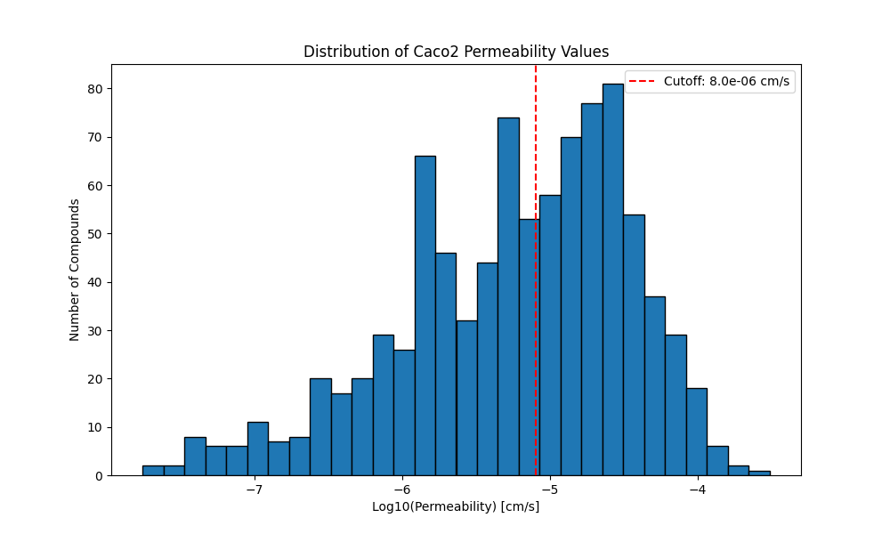

# Caco2_Wang Dataset Analysis

## Dataset 
The Caco2_Wang dataset contains experimental measurements of drug permeability through Caco2 cells, which are widely used as a model for human intestinal absorption. The permeability values are measured in centimeters per second (cm/s) and are typically reported in log scale.

### Binarization Approach
Following industry standards, we use a cutoff of 8.0e-06 cm/s to classify compounds:
- Values ≥ 8 × 10⁻⁶ cm/s are considered **high permeability** (1)
- Values < 8 × 10⁻⁶ cm/s are considered **low permeability** (0)

## Dataset Statistics
Total compounds: 910

### Permeability Distribution
- Minimum: 1.74e-08 cm/s
- Maximum: 3.09e-04 cm/s
- Mean: 1.72e-05 cm/s
- Median: 7.39e-06 cm/s

### Class Distribution
- Low permeability: 470 compounds (51.6%)
- High permeability: 440 compounds (48.4%)

### Data Splits
#### Train Set
- Size: 637 compounds
- Low permeability: 329 compounds (51.6%)
- High permeability: 308 compounds (48.4%)

#### Valid Set
- Size: 91 compounds
- Low permeability: 42 compounds (46.2%)
- High permeability: 49 compounds (53.8%)

#### Test Set
- Size: 182 compounds
- Low permeability: 99 compounds (54.4%)
- High permeability: 83 compounds (45.6%)

### Molecular Composition
The dataset contains organic molecules with the following characteristics:

#### Train Set
- SMILES length: min=8, max=221, mean=61.6
- Most common elements:
  - C: 7850 occurrences (57.3%)
  - O: 2819 occurrences (20.6%)
  - N: 1413 occurrences (10.3%)
  - H: 1254 occurrences (9.1%)
  - F: 212 occurrences (1.5%)

#### Valid Set
- SMILES length: min=6, max=163, mean=56.6
- Most common elements:
  - C: 1022 occurrences (58.1%)
  - O: 343 occurrences (19.5%)
  - N: 197 occurrences (11.2%)
  - H: 146 occurrences (8.3%)
  - F: 34 occurrences (1.9%)

#### Test Set
- SMILES length: min=2, max=138, mean=57.8
- Most common elements:
  - C: 2099 occurrences (57.8%)
  - O: 735 occurrences (20.3%)
  - N: 401 occurrences (11.0%)
  - H: 318 occurrences (8.8%)
  - S: 36 occurrences (1.0%)

## Visualization

The histogram shows the distribution of permeability values in log scale. The red dashed line indicates the cutoff value used for binary classification.